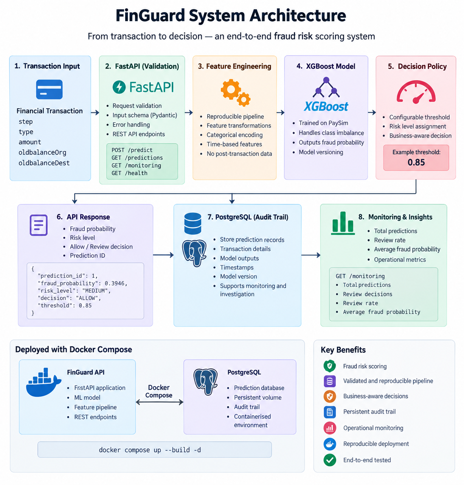
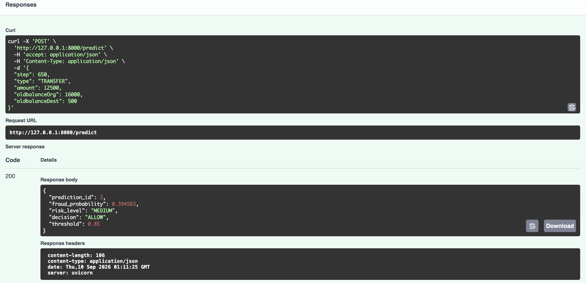
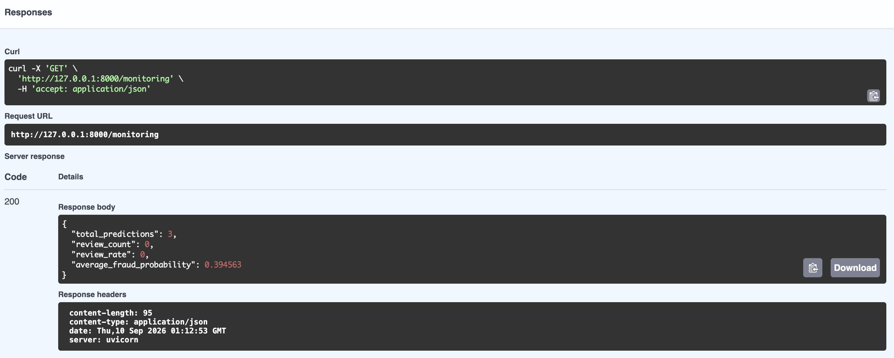
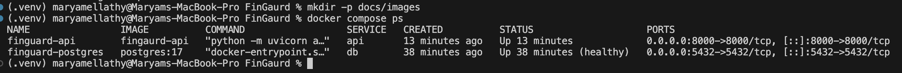

# FinGuard

**An end-to-end machine learning system for real-time financial transaction fraud risk scoring.**

FinGuard takes a financial transaction through a validated REST API, applies a reproducible feature-engineering pipeline and trained XGBoost model, converts the resulting fraud probability into a configurable operational decision, and persists predictions to PostgreSQL for auditability and monitoring.

The project is designed to demonstrate not only fraud modelling, but the engineering and decision-making required to turn an ML model into a deployable financial-services system.

---

## Why FinGuard?

Fraud detection is an extreme class-imbalance problem where accuracy alone can be misleading.

A model that predicts every transaction as legitimate can achieve very high accuracy while detecting no fraud at all.

FinGuard therefore focuses on:

- fraud recall and precision rather than raw accuracy
- PR-AUC for imbalanced-model evaluation
- temporal rather than random train/test splitting
- explicit investigation of suspiciously strong features
- business-aware decision thresholds
- reproducible inference
- API-based model serving
- prediction auditability
- operational monitoring

---

## System Architecture

FinGuard provides an end-to-end fraud risk scoring pipeline, from validated transaction input through ML inference, decision policy, persistent audit logging and operational monitoring.

<p align="center">
  
</p>
```

The API and PostgreSQL database are containerised using Docker Compose.

---

## Dataset

FinGuard was developed using the **PaySim synthetic mobile-money transaction dataset**.

PaySim simulates financial transactions using patterns derived from aggregated real transaction logs while avoiding the use of real customer transaction data.

The dataset contains:

- **6,362,620 transactions**
- **8,213 fraudulent transactions**
- approximately **0.129% fraud**
- 11 original variables
- 743 hourly simulation steps

The extreme class imbalance makes conventional accuracy a poor measure of fraud-detection performance.

> **Important:** PaySim is synthetic. Model performance should therefore not be interpreted as expected performance on real banking transactions.

The dataset itself is not stored in this repository.

---

## Leakage and Synthetic-Artifact Investigation

One of the most important findings during development was that the initial XGBoost model produced suspiciously near-perfect results.

Rather than treating this as successful model performance, the feature behaviour was investigated.

A derived feature:

```text
amount_equals_orig_balance
```

was found to behave almost like a proxy for the fraud label within PaySim.

Among transactions where this condition was true:

- 8,034 were fraudulent
- only 9 were legitimate

The feature consequently dominated XGBoost feature importance and produced unrealistically strong evaluation results.

Although the feature does not technically use future transaction information, it represents a strong **synthetic data-generation artifact** unlikely to generalise reliably to real financial systems.

Two feature-ablation experiments were therefore performed.

### Model comparison

| Model | Precision | Recall | F1 | PR-AUC |
|---|---:|---:|---:|---:|
| Full feature model | 1.0000 | 0.9994 | 0.9997 | 1.0000 |
| Remove exact balance-match feature | 0.9163 | 0.9994 | 0.9560 | 0.9938 |
| **Remove both balance shortcuts (deployed)** | **0.4060** | **0.9970** | **0.5770** | **0.9563** |

The deliberately more conservative third model was selected for deployment.

This sacrifices headline performance in favour of a feature set with a more credible generalisation story.

---

## Model Development

The deployed model is an `XGBClassifier` trained using a temporal split.

Transactions occurring earlier in the simulated period are used for training, while later transactions are held out for evaluation.

This better represents deployment than randomly mixing transactions from different points in time.

Class imbalance is handled using XGBoost's `scale_pos_weight`, calculated from the training data.

The deployed feature set contains:

```text
step
amount
oldbalanceOrg
oldbalanceDest
orig_balance_zero
hour
day
type_CASH_IN
type_CASH_OUT
type_DEBIT
type_PAYMENT
type_TRANSFER
```

Post-transaction values such as updated account balances are intentionally excluded from the real-time scoring pipeline.

---

## Decision Threshold

FinGuard deliberately separates:

```text
ML probability → operational decision
```

The model generates a fraud probability. A configurable policy threshold then determines whether the transaction should be allowed or sent for review.

The default demonstration threshold is:

```text
0.85
```

At evaluated thresholds, this produced approximately:

- **95.22% fraud recall**
- **66.82% precision**
- **782 false positives**

Compared with the default 0.50 threshold, this substantially reduces false-positive review workload while retaining more than 95% fraud recall.

The threshold is an example operating policy rather than a universal optimum. In a real financial institution it would depend on fraud exposure, investigation costs, customer friction, risk appetite and regulatory requirements.

---

## Cost-Sensitive Analysis

FinGuard also explores the relationship between missed-fraud exposure and false-positive review cost.

Because PaySim values are synthetic, monetary values are treated as **dataset monetary units**, not real GBP/USD losses.

The analysis demonstrates an important production ML principle:

> The statistically strongest threshold is not necessarily the operationally optimal threshold.

As the assumed cost of manually reviewing a transaction increases, the preferred decision threshold becomes more conservative.

---

## API

FinGuard exposes the model through FastAPI.

### `POST /predict`

Scores a transaction and stores the resulting decision.

Example request:

```json
{
  "step": 650,
  "type": "TRANSFER",
  "amount": 12500,
  "oldbalanceOrg": 16000,
  "oldbalanceDest": 500
}
```

Example response:

```json
{
  "prediction_id": 1,
  "fraud_probability": 0.394563,
  "risk_level": "MEDIUM",
  "decision": "ALLOW",
  "threshold": 0.85
}
```

Each scored transaction receives a persistent prediction ID for auditability.

### `GET /predictions`

Returns recent prediction records stored in PostgreSQL.

### `GET /monitoring`

Provides lightweight operational monitoring including:

- total predictions
- number of review decisions
- review rate
- average fraud probability

### `GET /health`

Provides a health check for the API and loaded model.

Interactive API documentation is available through Swagger UI at:

```text
http://localhost:8000/docs
```

---

## FinGuard in Action

### Real-Time Fraud Risk Scoring

Transactions are validated through the REST API and scored by the deployed XGBoost model. Each prediction returns a fraud probability, risk classification, operational decision and persistent prediction ID.

<p align="center">
  
</p>

### Operational Monitoring

Persisted predictions are aggregated into lightweight operational metrics for monitoring model usage and review workload.

<p align="center">
  
</p>

### Containerised Deployment

FinGuard's FastAPI service and PostgreSQL database run as separate Docker containers orchestrated with Docker Compose.

<p align="center">
  
</p>

---

## PostgreSQL Audit Trail

Predictions are persisted rather than disappearing after inference.

Each prediction record contains information including:

```text
prediction ID
timestamp
transaction type
transaction amount
fraud probability
risk level
decision
decision threshold
model version
```

This provides the foundation for model monitoring, investigation and decision traceability.

---

## Docker

The API and PostgreSQL database can be started together using Docker Compose.

```bash
docker compose up --build -d
```

Check container status:

```bash
docker compose ps
```

Then visit:

```text
http://localhost:8000/docs
```

Stop the system with:

```bash
docker compose down
```

PostgreSQL data is stored in a Docker volume so prediction history can persist across container restarts.

---

## Local Development

Create and activate a virtual environment:

```bash
python -m venv .venv
source .venv/bin/activate
```

Install dependencies:

```bash
pip install -r requirements.txt
```

Create a `.env` file containing your database connection:

```text
DATABASE_URL=postgresql://localhost/finguard
```

Then start the API:

```bash
python -m uvicorn api.main:app --reload
```

---

## Testing

FinGuard includes automated tests covering the feature pipeline, model inference and API behaviour.

Run:

```bash
python -m pytest -v
```

Current test suite:

```text
13 passed
```

API tests use an isolated SQLite test database rather than the production/development PostgreSQL prediction store.

Tests cover areas including:

- deterministic feature construction
- prediction structure
- probability bounds
- threshold validation
- API health
- transaction validation
- prediction creation
- prediction history
- pagination limits
- monitoring

---

## Repository Structure

```text
FinGaurd/
├── api/
│   └── main.py
├── artifacts/
│   ├── finguard_xgb.json
│   └── model_metadata.json
├── data/
│   ├── processed/
│   └── raw/
├── notebooks/
│   ├── 01_data_exploration.ipynb
│   ├── 02_feature_engineering.ipynb
│   └── 03_model_training_evaluation.ipynb
├── src/
│   ├── data/
│   │   ├── database.py
│   │   └── prediction_repository.py
│   ├── features/
│   │   └── build_features.py
│   └── models/
│       └── predict.py
├── tests/
├── Dockerfile
├── docker-compose.yml
├── requirements.txt
└── README.md
```

---

## Key Engineering Decisions

**Temporal validation instead of a random split**  
Reduces unrealistic information mixing between earlier and later transactions.

**No naive oversampling before splitting**  
Avoids introducing unnecessary leakage risk into evaluation.

**PR-AUC over accuracy**  
More informative for an extremely imbalanced fraud-detection problem.

**Removal of post-transaction features**  
Keeps inference compatible with a pre-authorisation scoring scenario.

**Synthetic-artifact ablation**  
Near-perfect model performance was investigated rather than accepted at face value.

**Probability separated from policy**  
Allows the operating threshold to change without retraining the model.

**Persistent prediction logging**  
Supports traceability and monitoring.

**Containerised application stack**  
Makes the API/database environment reproducible.

---

## Limitations

FinGuard is a portfolio and research-oriented system rather than a production banking fraud platform.

Important limitations include:

- PaySim is synthetic and contains dataset-specific fraud patterns.
- Transaction-type behaviour may be substantially cleaner than in real banking data.
- No customer history or graph/network features are available.
- No concept-drift detection is currently implemented.
- The operating threshold is illustrative rather than calibrated using real institutional costs.
- The system does not automatically block financial transactions; `ALLOW` and `REVIEW` represent demonstration policy decisions.

Real-world deployment would require institution-specific data, stronger security controls, model governance, drift monitoring, calibrated probabilities, human-review workflows and regulatory validation.

---

## Future Work

Potential extensions include:

- model and feature drift detection
- probability calibration
- richer transaction-history features
- customer/entity risk profiles
- graph-based fraud signals
- authentication and role-based API access
- monitoring dashboards
- model registry and controlled model versioning

---

## What This Project Demonstrates

FinGuard demonstrates the complete path from:

```text
raw transactions
        ↓
data exploration
        ↓
feature engineering
        ↓
imbalanced ML modelling
        ↓
artifact investigation
        ↓
model evaluation
        ↓
business threshold selection
        ↓
reproducible inference
        ↓
REST API
        ↓
PostgreSQL audit trail
        ↓
Docker deployment
        ↓
operational monitoring
```

The central goal is not simply to maximise a fraud metric, but to build a fraud-scoring system whose modelling assumptions, operational decisions and limitations can be explained.